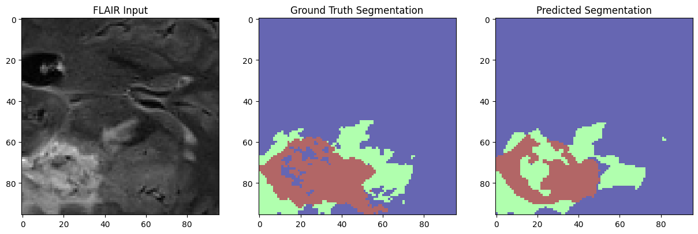
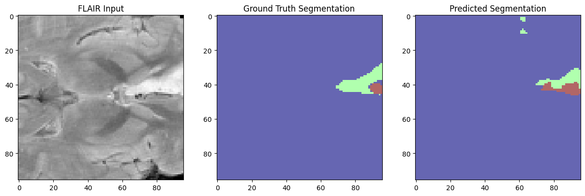

# 🧠 SwinUNETR-BraTS21

A PyTorch-based implementation of SwinUNETR for 3D brain tumor segmentation on the [BraTS 2021](https://www.kaggle.com/datasets/dschettler8845/brats-2021-task1) dataset, leveraging [MONAI](https://monai.io/) for efficient medical imaging workflows. This notebook explores how transformer-based architectures, specifically Swin Transformers, can enhance volumetric segmentation performance in medical imaging tasks.

---

## Task

The goal is to segment brain tumor subregions from multimodal 3D MRI scans. The subregions include:
- **ET**: Enhancing Tumor
- **WT**: Whole Tumor
- **TC**: Tumor Core

---

## Model

We use **SwinUNETR**, a hybrid architecture combining Swin Transformer blocks with the UNETR framework. It is particularly suited for 3D medical imaging due to its ability to model long-range dependencies while maintaining spatial precision.

> This notebook handles:
- Loading 3D MRI modalities (`T1`, `T1ce`, `T2`, `FLAIR`)
- Preprocessing (resampling, normalization, cropping)
- 3D volume segmentation
- Evaluation using Dice Score

**Note:** This model was trained for **only 1 epoch** and achieved a **Dice score of 0.68**. The goal is to demonstrate a working pipeline, not optimized performance.

---

## Example Segmentations

| Sample 1 | Sample 2 |
|----------|----------|
|  |  |
---

## 📁 Files

- `swinunetr-brats-21.ipynb` – Full pipeline including preprocessing, training, and inference
- `img/output*.png` – Visual results from inference (see above)

---

## 📚 References

- Hatamizadeh, A., Nath, V., Tang, Y., Yang, D., Roth, H., Xu, D., & Myronenko, A. (2022).  
  **Swin UNETR: Swin Transformers for Semantic Segmentation of 3D Medical Images**.  
  *arXiv preprint arXiv:2201.01266*.  
  [https://arxiv.org/abs/2201.01266](https://arxiv.org/abs/2201.01266)

- Schettler, D. (2021).  
  **BraTS 2021 Task 1 Dataset** – Brain Tumor Segmentation (MRI)  
  *Kaggle Dataset*.  
  [https://www.kaggle.com/datasets/dschettler8845/brats-2021-task1](https://www.kaggle.com/datasets/dschettler8845/brats-2021-task1)

- MONAI Consortium (2020–present).  
  **MONAI: Medical Open Network for AI** – A PyTorch-based framework for deep learning in healthcare imaging.  
  [https://github.com/Project-MONAI/MONAI](https://github.com/Project-MONAI/MONAI)
